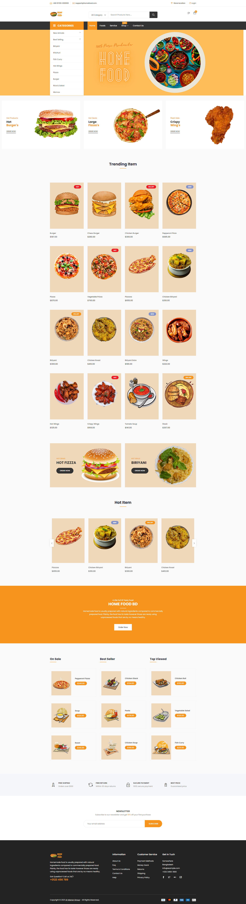
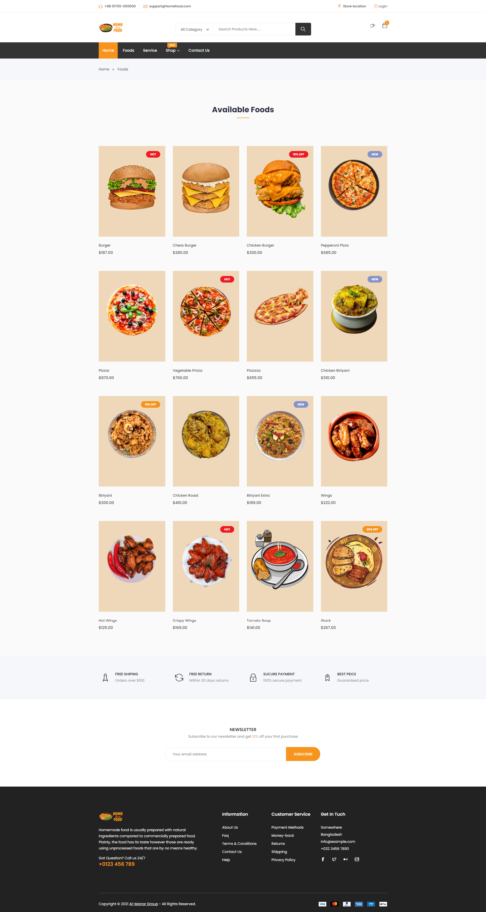
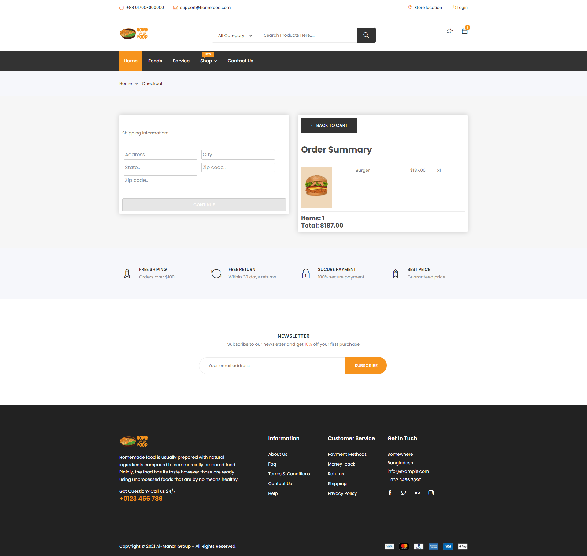
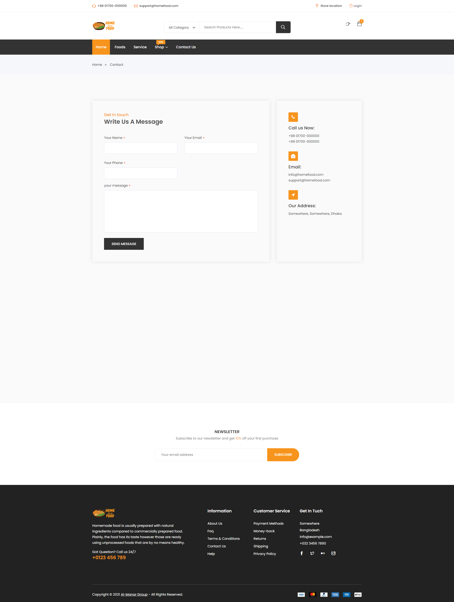

# HomeFood
This is a Dynamic Food Delivery Website.

## Features
- User and guest checkout capabilities.
- Setting up the templates and data structure in the first two modules.
- Adding user checkout flow with payment integration.
- After complete basic checkout with a logged-in user.
- Add in the ability for users to checkout as a guest using cookies.

## Technologies
1. Django (Backend)
2. Bootstrap (Frontend)
3. CSS (Frontend)
4. JavaScript (Client-Side)
5. Paypal Integration (Payment Method)

## Demonstration
<p align="left">
  
</p>

## Screen-Shots
#### HomePage
<p align="left">
  
</p>

<br>

#### Foods Page
<p align="left">
  
</p>

<br>

#### Cart Page
<p align="left">
  
</p>

<br>

#### CheckOut
<p align="left">
  
</p>

<br>

#### ContactPage
<p align="left">
  
</p>

<br>

## To Run This Project
1. clone this project on your local machine,
```
git clone https://github.com/ruhulaminparvez/Grocery-Store.git
```
2. create a virtual environment inside eCommerce folder,
```
virtualenv venv
```
3. activate virtual environment,(for windows)
```
.\venv\Scripts\activate 
```
4. install project dependencies from requirements.txt,
```
pip install -r requirements.txt
```
5. run project on your local machine,
```
python manage.py runserver
```


## Bugs
> *If there any known bugs found or run into any issues please let me know. Please enjoy and feel free to share your opinion, constructive criticism, or comments about my work. Email: 👉 ruhulaminparvez007@gmail.com 😊 Thank you!*
